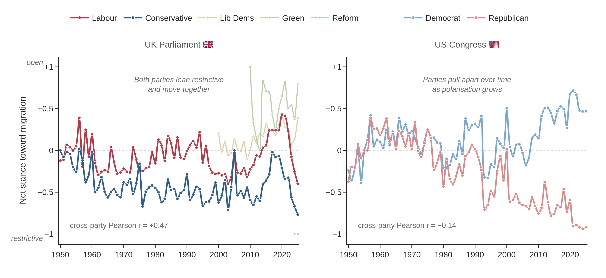
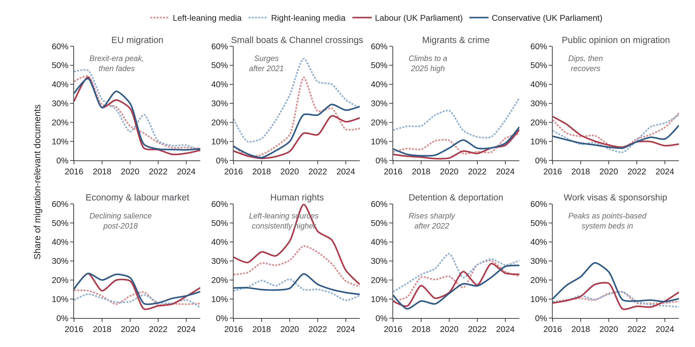
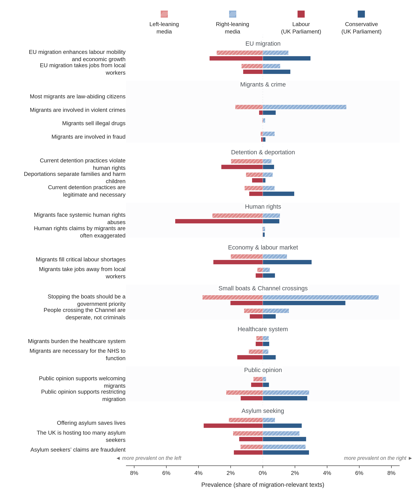
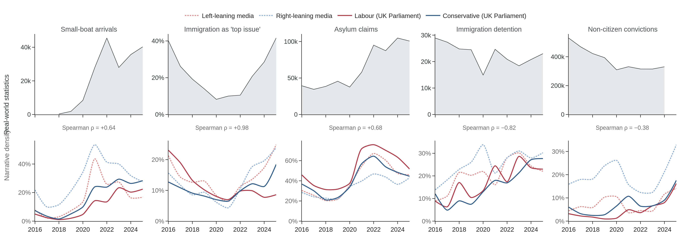

# Paper Figures

Figs 5–8 of *Narratives in Motion*, built with Plotly and exported to PNG/SVG/PDF from the same pre-computed monthly aggregates as the analysis notebook.

## Quick start

```bash
cd MigNar_FrontEnd_Streamlit
python -m venv .venv && source .venv/bin/activate
pip install pandas numpy scipy pyarrow plotly 'kaleido<1' openpyxl odfpy
cd paper_figures && ../.venv/bin/python make_all.py
```

Outputs land in `output/{png,svg,pdf}/`.

**Kaleido v1+:** install Chrome/Chromium and set `BROWSER_PATH`, or run `../.venv/bin/kaleido_get_chrome --path .chrome` from `paper_figures/`.

## Files

```
style.py          shared palette, typography, export helper
data.py           stance / theme / meso prevalence loaders
rw_data.py        real-world statistic loaders (Fig 8)
fig5_stance.py    fig6_themes.py    fig7_meso.py    fig8_realworld.py
make_all.py       entry point — writes PNG + SVG + PDF for all figures
output/           exported figures (png/ svg/ pdf/)
```

---

## Figures

### Fig 5 — Net attitude towards immigration

**RQ.** How has each main party's net stance towards migration evolved, and are the two parties converging or diverging?



**Net political stance towards immigration in the UK Parliament (left) and US Congress (right), 1950–2025.** Each chart shows the yearly net stance of the two main parties computed as (open − restrictive) ÷ (open + restrictive + neutral), ranging from −1 (uniformly restrictive) to +1 (uniformly open), with the dotted horizontal line marking the open/restrictive watershed; Pearson *r* is used because both series operate on the same bounded scale and the figure tests linear co-movement in levels across a long annual series. In the UK, Conservative and Labour stances remained predominantly restrictive throughout the period and tracked one another closely (*r* = +0.47); in the US, Democrat and Republican stances progressively diverged over the same interval (*r* = −0.14), consistent with growing ideological polarisation.

---

### Fig 6 — Theme prevalence over time

**RQ.** How has the focus of UK migration debate shifted over time, and do news media and Parliament foreground the same themes at the same moments?



**Prevalence of eight migration themes in UK news media and Parliament, 2016–2025.** Each small multiple tracks the share of migration-relevant documents mentioning the theme for left- and right-leaning news media (dashed lines) and Labour and Conservative parliamentary contributions (solid lines); y-axes are scaled independently per theme to reveal trajectory rather than absolute magnitude. EU migration discourse (top left) peaks around the Brexit referendum and then declines markedly; small-boat crossing coverage (top, second from left) surges after 2021; migrants-and-crime references (top, third) climb to a 2025 high; and public-opinion mentions (top right) recover after a dip during 2018–2020.

---

### Fig 7 — Comparative meso-narrative prevalence

**RQ.** For specific argumentative claims within key themes, how does prevalence differ across the ideological divide and across institutions?



**Comparative prevalence of specific meso-narratives by ideology and institution, 2016–2025.** Bars extend leftward for left-leaning sources (red, top of each pair) and rightward for right-leaning sources (blue, bottom of each pair); news-media bars are hatched and Parliament bars are solid; the horizontal axis gives the share of migration-relevant texts mentioning each claim, with claims grouped into labelled theme blocks reading top to bottom. Restrictive claims such as stopping the boats, asylum-fraud allegations, and migrants burdening the NHS are consistently more prevalent on the right and within the Conservative party; economy-and-labour-market claims are near-symmetric across the ideological divide, indicating broad cross-party salience.

---

### Fig 8 — Discourse vs real-world statistics

**RQ.** Do shifts in migration discourse track real-world events, or move on a different timetable?



**Migration discourse versus real-world statistics across five domains, 2016–2025.** Each column shows one domain: the top row (grey area, left axis) gives the annual real-world series and the bottom row (coloured lines, right axis) gives the corresponding narrative theme's prevalence across four source domains; the Spearman ρ between the rows summarises rank co-movement, preferred over Pearson because these short annual series exhibit monotonic movement with spikes rather than a clean linear relationship. Discourse tracks reality most closely for immigration as a public-concern indicator (ρ = +0.98, second column from left) and small-boat arrivals (ρ = +0.64, leftmost column), tracks asylum claims moderately (ρ = +0.68, centre), and decouples most sharply for non-citizen convictions (rightmost column), where coverage rises while recorded convictions remain comparatively flat (ρ = −0.38).

---

## Design system

Plotly `simple_white`; no gridlines; outside ticks only; no chart titles. Panel-level `(a) (b)` tags carry the explanation to the caption.

| Palette role | Colour | Style |
|---|---|---|
| Left-leaning media | coral red `#E08A8A` | dashed |
| Right-leaning media | soft blue `#8FB0D6` | dashed |
| Labour (Parliament) | deep rose `#B23A48` | solid |
| Conservative (Parliament) | deep blue `#2F5C8A` | solid |
| Real-world series | charcoal `#33373B` | filled area |
